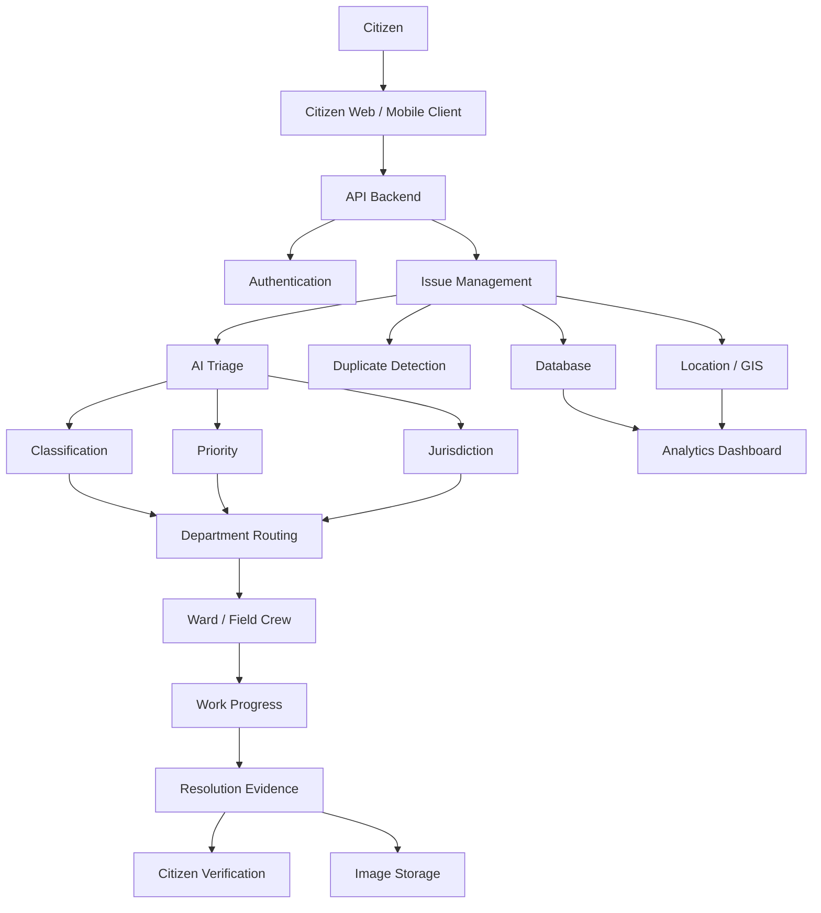

<div align="center">

# 🏙️ Civic Pulse

### **Every civic issue, tracked to resolution.**

**Report · Route · Track · Fix · Verify**

A civic accountability platform connecting residents with the municipal teams responsible for resolving local infrastructure and public-service issues.

<br />

[](https://civic-pulse-fyp-main.vercel.app/)
[](https://civic-pulse-fyp-main.vercel.app/)
[](https://civic-pulse-fyp-main.vercel.app/)
[](https://civic-pulse-fyp-main.vercel.app/)

<br />

### 🌐 Live Demo

**https://civic-pulse-fyp-main.vercel.app/**

</div>

---

# 📖 Overview

**Civic Pulse** is a civic accountability platform designed to create a direct and transparent connection between residents and the municipal teams responsible for solving local civic issues.

Instead of treating a complaint as a simple form submission, Civic Pulse follows the issue throughout its complete lifecycle:

```text
Citizen
   ↓
Report
   ↓
AI Triage
   ↓
Department Routing
   ↓
Assignment
   ↓
Live Tracking
   ↓
Resolution
   ↓
Photo Verification
   ↓
Closure
```

The platform focuses on one central idea:

> **A civic complaint should not disappear after submission. It should remain trackable until there is evidence that the issue has been addressed.**

The current product concept includes intelligent issue classification, department routing, duplicate detection, status tracking, service-level deadlines, and evidence-based resolution.

---

# 🌐 Live Demo

## Civic Pulse

[Open the Civic Pulse Live Demo](https://civic-pulse-fyp-main.vercel.app/?utm_source=chatgpt.com)

The current demo presents the Civic Pulse workflow and interface, including:

- Citizen issue reporting
- AI-assisted triage
- Department routing
- Duplicate merging
- Ward-level assignment
- SLA tracking
- Status history
- Before/after resolution evidence
- Photo-verified closure

The deployed site explicitly identifies itself as a **demo build with no live municipal data**.

---

# 🎯 Problem Statement

Civic problems are visible every day, but the path from **identifying a problem to confirming its resolution** can be fragmented.

A resident may encounter:

- A pothole
- Broken street lighting
- Road damage
- Waste accumulation
- Water leakage
- Drainage problems
- Damaged public infrastructure
- Other neighborhood-level issues

The traditional workflow can become:

```text
Problem noticed
      ↓
Citizen finds where to complain
      ↓
Complaint submitted
      ↓
Complaint enters a queue
      ↓
Unclear ownership
      ↓
Limited status visibility
      ↓
Issue may remain unresolved
```

Civic Pulse attempts to close this gap by giving every issue a structured lifecycle and a visible status trail.

---

# 💡 Solution

Civic Pulse introduces a structured civic accountability workflow:

```text
┌─────────────┐
│   REPORT    │
│ Citizen     │
│ Photo       │
│ Location    │
│ Description │
└──────┬──────┘
       ↓
┌─────────────┐
│ AI TRIAGE   │
│ Category    │
│ Severity    │
│ Jurisdiction│
└──────┬──────┘
       ↓
┌─────────────┐
│   ROUTE     │
│ Department  │
│ Ward        │
│ Field Crew  │
└──────┬──────┘
       ↓
┌─────────────┐
│   TRACK     │
│ Status      │
│ Timeline    │
│ SLA         │
└──────┬──────┘
       ↓
┌─────────────┐
│   RESOLVE   │
│ Field Work  │
│ Evidence    │
└──────┬──────┘
       ↓
┌─────────────┐
│   VERIFY    │
│ Photo Proof │
│ Closure     │
└─────────────┘
```

---

# ✨ Core Features

## 📍 1. Citizen Issue Reporting

Residents can report a civic problem by providing:

- Issue category
- Description
- Location
- Photograph
- Geographic information

The intended reporting process is designed to be completed quickly, with the live demo describing a flow involving mobile-number login, category selection, description, map location confirmation, and photo attachment.

---

# 🤖 2. Intelligent AI Triage

Civic Pulse uses AI-assisted triage to structure incoming reports.

The system can conceptually determine:

```text
                    Report
                       │
          ┌────────────┼────────────┐
          ▼            ▼            ▼
       Issue         Severity    Jurisdiction
       Type
          │            │            │
          └────────────┼────────────┘
                       ▼
                 Routing Decision
```

For example:

```text
Input:

"Large pothole near the school entrance."

        ↓

AI Triage

Issue:
Road Damage

Priority:
Tier 1

Department:
Public Works & Roads

Ward:
Zone 4

        ↓

Field Assignment
```

The live demo illustrates this concept with AI-assisted classification, a priority tier, department, ward and confidence score.

> **Important:** AI classification should remain an assistance mechanism. Final operational decisions should be subject to appropriate human oversight.

---

# 🔁 3. Duplicate Detection

A major problem with public reporting systems is repeated reports for the same physical issue.

Civic Pulse is designed to identify potentially duplicate complaints.

### Without duplicate detection

```text
Citizen A → Pothole #1
Citizen B → Pothole #2
Citizen C → Pothole #3
Citizen D → Pothole #4
```

### With duplicate detection

```text
Citizen A ──┐
Citizen B ──┤
Citizen C ──┼──► Same Civic Issue
Citizen D ──┘
```

The live demonstration specifically presents duplicate reports being merged into an existing case rather than creating another independent case.

---

# 🏛️ 4. Smart Department Routing

Once an issue has been classified, Civic Pulse can route it toward the relevant operational department.

Example:

```text
Road Damage
     ↓
Public Works
     ↓
Ward / Zone
     ↓
Road Maintenance Team
```

The goal is to prevent every complaint from entering one generic queue.

The live product describes routing from citizen submission to the appropriate operational team and then to a field crew covering the relevant ward.

---

# ⏱️ 5. SLA Tracking

Civic Pulse introduces service-level expectations into the issue lifecycle.

Example:

```text
Issue
 ↓
Priority
 ↓
SLA
 ↓
Deadline
 ↓
Escalation if overdue
```

A high-priority issue could receive a shorter expected response window than a low-priority issue.

The current demo illustrates an example response SLA attached to a classified civic issue.

---

# 📊 6. Transparent Status Tracking

Every complaint receives a unique identifier and a visible lifecycle.

```text
Reported
    ↓
Verified
    ↓
Assigned
    ↓
In Progress
    ↓
Resolved
```

Each stage can have a timestamp and supporting information.

This gives citizens a clear answer to:

> **"What happened to my complaint?"**

The live demo describes a public status trail with timestamps for the major lifecycle stages.

---

# 📸 7. Photo-Verified Resolution

Civic Pulse is designed around the principle that:

> **A complaint should not simply be marked "resolved"; there should be evidence of the work.**

The intended workflow is:

```text
BEFORE
Citizen Photo
     ↓
WORK
Field Crew
     ↓
AFTER
Resolution Photo
     ↓
VERIFIED CLOSURE
```

The demo shows citizen-submitted evidence alongside field-work and closure evidence.

---

# 🧭 8. Geographic Context

Location is an important part of civic reporting.

Each report can contain:

```text
Latitude
Longitude
Address
Ward
Zone
```

This enables future geographic analysis such as:

- Issue density
- Ward-level trends
- Infrastructure hotspots
- Recurring problem locations
- Department workload by geography

---

# 🔄 Complete Issue Lifecycle

The complete Civic Pulse workflow can be represented as:

```text
                 CIVIC ISSUE
                     │
                     ▼
              ┌──────────────┐
              │    REPORT    │
              └──────┬───────┘
                     ▼
              ┌──────────────┐
              │ AI TRIAGE    │
              └──────┬───────┘
                     ▼
              ┌──────────────┐
              │   ROUTING    │
              └──────┬───────┘
                     ▼
              ┌──────────────┐
              │ ASSIGNMENT   │
              └──────┬───────┘
                     ▼
              ┌──────────────┐
              │ IN PROGRESS  │
              └──────┬───────┘
                     ▼
              ┌──────────────┐
              │  RESOLUTION  │
              └──────┬───────┘
                     ▼
              ┌──────────────┐
              │ PHOTO PROOF  │
              └──────┬───────┘
                     ▼
              ┌──────────────┐
              │   VERIFIED   │
              └──────────────┘
```

---

# 🏗️ System Architecture



---

# 👥 User Roles

## 👤 Citizen

```text
Login
  ↓
Report Issue
  ↓
Track Status
  ↓
View Evidence
  ↓
Verify Resolution
```

---

## 🧑‍💼 Field Officer

```text
Receive Assignment
       ↓
View Issue
       ↓
Navigate to Location
       ↓
Update Progress
       ↓
Upload Evidence
       ↓
Submit Resolution
```

---

## 🏛️ Administrator / Municipal Team

```text
Dashboard
    ↓
Review Issues
    ↓
Manage Departments
    ↓
Manage Ward Assignments
    ↓
Monitor SLAs
    ↓
Analyze Resolution Performance
```

---

# 📊 Administrative Intelligence

A future authority dashboard can provide:

```text
┌──────────────────────────────────────┐
│          CIVIC OPERATIONS            │
├──────────────────────────────────────┤
│ Open Issues             1,284        │
│ In Progress               347        │
│ Resolved                  932        │
│ Overdue                    58        │
├──────────────────────────────────────┤
│ Average Resolution       2.8 days    │
│ Duplicate Rate             14%       │
│ SLA Compliance             91%       │
└──────────────────────────────────────┘
```

These figures are illustrative; production deployments should use actual system data.

---

# 🗺️ Civic Heatmaps

Aggregated geographic data can eventually be visualized as a city-level civic heatmap.

```text
                 CITY
       ┌──────────────────────┐
       │       ● ●            │
       │      ● ● ●           │
       │                      │
       │   ● ● ●●●            │
       │    ● ●               │
       │                 ●    │
       │              ● ● ●   │
       └──────────────────────┘
```

Possible analysis:

```text
Issue Type
     +
Location
     +
Time
     +
Severity
     ↓
Civic Hotspot
```

---

# 🧠 Research Foundation

Civic Pulse is based on research directions involving **crowdsourced civic reporting, automated classification, geospatial information, AI-assisted monitoring and evidence-based resolution**.

The research is used as a foundation for the system's design and future development rather than as a claim that every research technique is already implemented.

---

## Research Area 1 — Crowdsourced Civic Reporting

Crowdsourced civic systems allow citizens to contribute observations about infrastructure and public-service problems.

The approach supports the fundamental Civic Pulse model:

```text
Citizen
   ↓
Report
   ↓
Location + Evidence
   ↓
Central System
   ↓
Authority
   ↓
Resolution
```

This is directly relevant to Civic Pulse's citizen reporting and issue-resolution workflow.

**Reference:**

Sudha, N., Nithya, R., Subasri, M., & Supritha, R. (2026).

*Crowdsourced Civic Issue Reporting and Resolution System.*

International Journal of Creative Research Thoughts (IJCRT), 14(3).

---

# 🤖 Research Area 2 — AI-Based Civic Monitoring

Recent work has explored AI-assisted monitoring of civic issues through combinations of:

- Computer vision
- Crowdsourced reports
- Geospatial information
- Automated categorization
- Civic dashboards

This research direction supports Civic Pulse's intelligent triage architecture and its future computer-vision capabilities.

**Reference:**

Tiwari, N., Singh, S., Singh, R., Siripuram, K., & Parmar, N. (2026).

*AI-Driven Monitoring System for Civic Issues at Ward Level.*

International Journal of Creative Research Thoughts (IJCRT), 14(4).

---

# 🌐 Research Area 3 — Multimodal Civic Reporting

Modern civic-reporting systems can combine multiple information sources:

```text
Text
 +
Images
 +
GPS
 +
Citizen Reports
 +
AI
```

This direction is particularly relevant to Civic Pulse because a report is not treated as text alone.

The platform's conceptual model combines:

```text
Description
     +
Photo
     +
Location
     +
Classification
     +
Priority
```

**Reference:**

Shakunthala, M., Abinaya, L., Mohanapriya, H., Yogasree, V., & Abinayashree, R. (2026).

*Vikaspath: Crowdsourced Civic Issue Reporting and Resolution System.*

International Journal of Emerging Engineering Trends and Research.

DOI: `10.15662/IJEETR.2026.0802129`

---

# 🔬 Research-to-Product Mapping

| Research Concept | Civic Pulse Application |
|---|---|
| Crowdsourcing | Citizen issue reporting |
| GPS / Geospatial Data | Issue location |
| Image Evidence | Civic issue photographs |
| AI Classification | Intelligent triage |
| Severity Analysis | Priority tiers |
| Automated Routing | Department assignment |
| GIS | Future civic heatmaps |
| Computer Vision | Future image analysis |
| Predictive Analytics | Future issue forecasting |
| Crowd Validation | Future community verification |
| Data Analytics | Authority dashboards |

---

# 🔮 Future Scope

Civic Pulse can develop from a **civic reporting platform** into a broader **civic intelligence system**.

---

## Phase 1 — Smarter Citizen Reporting

Improve the reporting experience through:

- Automatic location detection
- Better category suggestions
- Voice-based reporting
- Multilingual reporting
- Improved image capture
- Offline report creation
- Automatic address detection

Example:

```text
Citizen speaks
      ↓
Speech → Text
      ↓
AI Classification
      ↓
Location
      ↓
Structured Report
```

---

# Phase 2 — Advanced AI Triage

Future versions can evaluate:

```text
Issue Type
+
Severity
+
Location
+
Historical Reports
+
Infrastructure Context
```

The result can be a more informed routing and prioritization recommendation.

---

# Phase 3 — Computer Vision

Computer vision could analyze uploaded photographs.

Example:

```text
Photo
 ↓
Computer Vision
 ↓
Detected:
Road Damage
 ↓
Confidence
 ↓
Human Review
 ↓
Civic Report
```

Potential future detection areas include:

- Potholes
- Road cracks
- Overflowing waste bins
- Damaged streetlights
- Water leakage
- Infrastructure deterioration

---

# Phase 4 — Predictive Civic Maintenance

Instead of waiting for citizens to report every problem:

```text
Historical Data
      +
Weather
      +
Infrastructure Age
      +
Previous Complaints
      +
Location
      ↓
Predictive Model
      ↓
Potential Risk Area
```

Authorities could then investigate high-risk locations proactively.

---

# Phase 5 — Smart Ward Intelligence

Civic Pulse could provide ward-level intelligence.

```text
WARD 01
├── Road Issues       124
├── Waste Issues       67
├── Water Issues       31
├── Lighting Issues    18
└── Average Resolution
        2.4 days
```

This could help municipal teams understand where resources are being consumed.

---

# Phase 6 — Automated Escalation

If an issue remains unresolved beyond its SLA:

```text
Issue Assigned
      ↓
SLA Countdown
      ↓
No Resolution
      ↓
Automatic Escalation
      ↓
Senior Officer
      ↓
Management Dashboard
```

This would make the accountability layer stronger.

---

# Phase 7 — Community Verification

Multiple citizens could validate an issue.

```text
Citizen A ──┐
Citizen B ──┤
Citizen C ──┼──► Community Signal
Citizen D ──┘
```

A stronger community signal could help prioritize recurring or widespread problems.

---

# Phase 8 — IoT Integration

Civic Pulse could eventually accept data from infrastructure sensors.

```text
IoT Sensor
     ↓
Abnormal Reading
     ↓
Civic Pulse
     ↓
Risk Detection
     ↓
Authority Notification
```

For example, environmental or infrastructure sensors could supplement citizen-generated reports.

---

# Phase 9 — Municipal API Integration

A mature version could integrate with existing municipal systems.

```text
                   Civic Pulse
                       │
       ┌───────────────┼────────────────┐
       ▼               ▼                ▼
  Municipal CRM    GIS Systems      Work Orders
       │               │                │
       └───────────────┼────────────────┘
                       ▼
                Unified Workflow
```

This would allow Civic Pulse to become an interoperability layer rather than requiring municipalities to completely replace existing systems.

---

# 🌍 Long-Term Vision

The long-term vision is:

> **Move from reactive complaint management to proactive civic intelligence.**

```text
                   CIVIC PULSE
                        │
        ┌───────────────┼────────────────┐
        │               │                │
        ▼               ▼                ▼
     REPORT          MONITOR          ANALYZE
        │               │                │
        └───────────────┼────────────────┘
                        ▼
                   INTELLIGENCE
                        │
             ┌──────────┼──────────┐
             ▼          ▼          ▼
          ROUTING    PREDICTION  PLANNING
             │          │          │
             └──────────┼──────────┘
                        ▼
                 BETTER DECISIONS
                        │
                        ▼
                  BETTER CITIES
```

---

# ⚠️ Limitations

Civic Pulse is a technology platform and cannot independently guarantee that a municipal issue will be resolved.

Important limitations include:

- Municipal participation is required.
- AI classifications can be incorrect.
- Citizen reports may contain inaccurate information.
- GPS information can be imprecise.
- Computer vision predictions require validation.
- Municipal workflows differ between cities.
- Integration with existing government systems can be complex.
- Privacy must be protected when collecting images and location information.
- Automated decisions should maintain appropriate human oversight.

The current deployed site is explicitly a **demo build and does not use live municipal data**.

---

# 📈 Evaluation Metrics

Future deployments can evaluate Civic Pulse using measurable indicators.

## Citizen Experience

```text
Report Completion Rate
Average Reporting Time
Citizen Satisfaction
Repeat Usage
Resolution Verification Rate
```

## Municipal Operations

```text
Average Response Time
Average Resolution Time
SLA Compliance
Overdue Issues
Duplicate Rate
Department Workload
```

## AI Performance

```text
Classification Accuracy
Routing Accuracy
Duplicate Detection Precision
Severity Prediction Accuracy
Computer Vision Accuracy
```

---

# 🧪 Future Research Opportunities

Civic Pulse can provide a foundation for further research in:

- Civic crowdsourcing
- Human-AI collaboration
- Computer vision
- GIS-based urban analytics
- Geospatial machine learning
- Predictive maintenance
- Smart-city infrastructure
- Public-service optimization
- Citizen participation
- Multimodal AI
- Urban data science

A particularly strong research direction is the combination of **citizen-generated observations, geographic information and AI-assisted analysis** to move civic management toward proactive infrastructure maintenance.

---

# 🛡️ Security & Privacy

Civic platforms can contain location, images and account information, so security is a core requirement.

Civic Pulse should follow:

```text
Authentication
      ↓
Authorization
      ↓
Input Validation
      ↓
Secure Storage
      ↓
Controlled Access
      ↓
Audit Logging
```

Recommended protections include:

- Role-based access control
- Secure authentication
- API authorization
- Rate limiting
- Secure image uploads
- Input validation
- Encrypted connections
- Minimal personal-data collection
- Controlled access to location information
- Audit logs

---

# 📂 Project Structure

The current project architecture is organized as a multi-application system:

```text
CivicPulse/
│
├── civiclens-backend/
│   ├── app/
│   ├── tests/
│   ├── migrations/
│   ├── scripts/
│   ├── pyproject.toml
│   └── README.md
│
├── civiclens-client/
│   ├── src/
│   ├── public/
│   └── package.json
│
├── civiclens-admin/
│   ├── src/
│   └── package.json
│
├── civiclens-mobile/
│   ├── src/
│   ├── assets/
│   └── package.json
│
├── docker-compose.yml
├── .env
├── .env.example
├── CLAUDE.md
└── README.md
```

---

# 🚀 Development Setup

## Backend

```bash
cd civiclens-backend

uv sync

uv run alembic upgrade head

uv run python scripts/seed.py

uv run uvicorn app.main:app --reload
```

API documentation:

```text
http://localhost:8000/docs
```

---

# 💻 Client

```bash
cd civiclens-client

npm install

npm run dev
```

---

# 🛠️ Admin

```bash
cd civiclens-admin

npm install

npm run dev
```

---

# 📱 Mobile

```bash
cd civiclens-mobile

npm install

npx expo start
```

---

# 🐳 Docker

Start the complete development environment:

```bash
docker compose up --build
```

Stop:

```bash
docker compose down
```

View logs:

```bash
docker compose logs -f
```

---

# 🤝 Contributing

Contributions are welcome.

Create a feature branch:

```bash
git checkout -b feature/your-feature
```

Make your changes and test them before creating a pull request.

### Recommended commit format

```text
feat: add new functionality
fix: resolve an issue
docs: update documentation
refactor: improve architecture
test: add tests
perf: improve performance
security: security improvement
```

Example:

```bash
git commit -m "feat: add duplicate issue detection"
```

---

# 📚 References

### Research

1. Sudha, N., Nithya, R., Subasri, M., & Supritha, R. (2026). *Crowdsourced Civic Issue Reporting and Resolution System*. International Journal of Creative Research Thoughts (IJCRT), 14(3).

2. Tiwari, N., Singh, S., Singh, R., Siripuram, K., & Parmar, N. (2026). *AI-Driven Monitoring System for Civic Issues at Ward Level*. International Journal of Creative Research Thoughts (IJCRT), 14(4).

3. Shakunthala, M., Abinaya, L., Mohanapriya, H., Yogasree, V., & Abinayashree, R. (2026). *Vikaspath: Crowdsourced Civic Issue Reporting and Resolution System*. International Journal of Emerging Engineering Trends and Research. DOI: `10.15662/IJEETR.2026.0802129`.

### Project Reference

**Civic Pulse — Live Demo**

[https://civic-pulse-fyp-main.vercel.app/](https://civic-pulse-fyp-main.vercel.app/?utm_source=chatgpt.com)

---

# 📄 License

This project is released under the **MIT License**.

See [`LICENSE`](LICENSE) for the complete license text.

---

<div align="center">

# 🏙️ Civic Pulse

### **Report. Route. Track. Fix. Verify.**

**Every civic issue, tracked to resolution.**

<br />

[Live Demo → Civic Pulse](https://civic-pulse-fyp-main.vercel.app/?utm_source=chatgpt.com)

</div>
